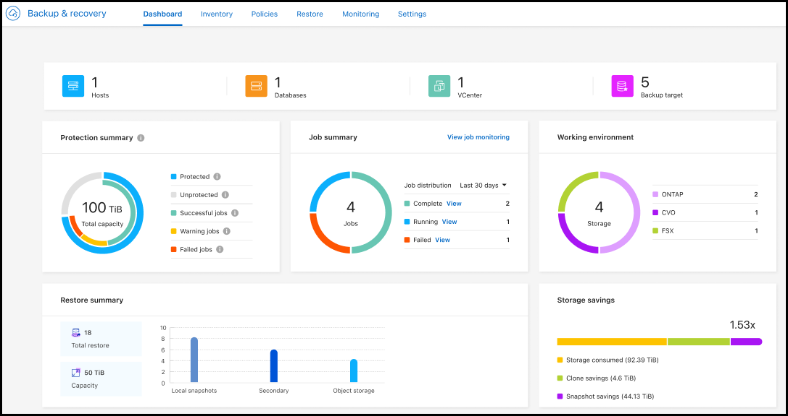

=== Microsoft SQL Server workload supported in General Availability (GA)

We are excited to announce that Microsoft SQL Server workload support is now generally available (GA) in BlueXP Backup & Recovery. Organizations using an MSSQL environment on ONTAP, Cloud Volumes ONTAP, and Amazon FSx for NetApp ONTAP storage can now take advantage of this new backup and recovery service to protect their data. 

This release includes the following enhancements to the Microsoft SQL Server workload support from the previous preview version: 

* *SnapMirror active sync*: This version now supports SnapMirror active sync (also referred to as SnapMirror Business Continuity [SM-BC]), enables business services to continue operating even through a complete site failure, supporting applications to fail over transparently using a secondary copy. BlueXP backup and recovery now supportsprotection of Microsoft SQL Server databases in a SnapMirror active sync and Metrocluster configuration. The information appears in the *Storage and relationship status* section of the Protection details page. 
+
image:../media/screen-br-sql-protection-details.png[Protection details page for Microsoft SQL Server workload]
* *Multi-bucket support*: You can now protect the volumes within a working environment with multiple buckets across different cloud providers.
* *Licensing and free trial updates* for SQL Server workloads: You can now use the existing BlueXP backup a recovery licensing model to protect SQL Server workloads. There is no separate licensing requirement for SQL Server workloads.
+ 
See link:br-start-licensing.html[Set up licensing for BlueXP backup and recovery] for more information about licensing.
* *SnapMirror and SnapVault SMAS secondary relationship*: You can now use SnapMirror and SnapVault SMAS secondary relationships for SQL Server workloads. The relationship information is displayed in the updated *Secondary settings* section of the Policy page.
+
See link:br-use-policies-create.html[Use policies to protect your workloads] for more information about policies.

* *Custom snapshot name*: You can now use your own snapshot name in a policy that governs the backups for Microsoft SQL Server workloads. Enter this information in the *Advanced settings* section of the Policy page. 
+
image:../media/screen-br-sql-policy-create-advanced-snapmirror.png[SnapMirror and snapshot format settings screenshot for BlueXP backup and recovery policies]   
+
See link:br-use-policies-create.html[Use policies to protect your workloads] for more information about policies.

* *Secondary volume prefix and suffix*: You can enter a custom prefix and suffix in the *Advanced settings* section of the Policy page.
* *Role-based access control*: You can now control users' access to features. 
+
For details, see link:br-start-login.html[Log in to BlueXP backup and recovery] and link:reference-roles.html[BlueXP backup and recovery role-based access to features].
* *Restore from object storage to an alternate host*: You can now restore from object storage to an alternate host even if the primary storage is down.
* *Log backup data*: The database protection details page now shows log backups. You can see the Backup type column that shows whether the backup is a full backup or a log backup. 
* *Enhanced Dashboard*: The Dashboard now shows Storage and Clone savings.
+

=== High performance indexing for AWS, Azure, and GCP is generally available

In February 2025, we announced the preview of high performance indexing (Indexed Catalog v2) for AWS, Azure, and GCP. This feature is now generally available (GA). In June 2025, we provided it to all new customers by default. With this release, the support is available to all customers. High performance indexing improves the performance of backup and restore operations for workloads that are protected to object storage. 

Enabled by default: 

* If you are a new customer, high performance indexing is enabled by default. 
* If you are an existing customer, you can enable reindexing by going to the Restore section of the UI.

=== ONTAP volume workload enhancements

* *Multi-folder restore for ONTAP volumes*: Until now, you could restore either one folder or multiple files at a time from the Browse and restore feature. BlueXP backup and recovery now provides the ability to select multiple folders at a time using the Browse and restore feature.

* *View and manage backups of deleted volumes*: The BlueXP backup and recovery Dashboard now gives an option to show and manage volumes that are deleted from ONTAP. With this, you can view and delete backups from volumes that no longer exist in ONTAP.

For details, see link:prev-ontap-protect-overview.html[Protect ONTAP workloads].

